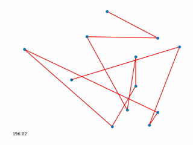

Python experiments
==================

Traveling Salesman Problem
--------------------------

Dead simple solution using [simulated annealing](https://en.wikipedia.org/wiki/Simulated_annealing) algoritm

Another approach with genetic algoritm. The solution provides quite good result quality while it is simple and quick (depsite using simplified crossing over algorithm)

Forest Fire
-----------

[Forest fire model](https://en.wikipedia.org/wiki/Forest-fire_model) python implementation.

Game of life
------------

Simple [Conway's game of life](https://en.wikipedia.org/wiki/Conway%27s_Game_of_Life) python implementation. 

